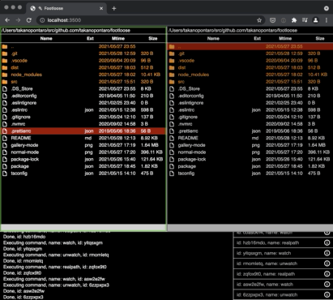
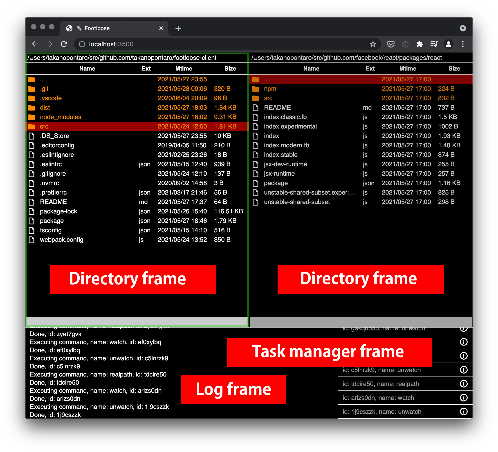
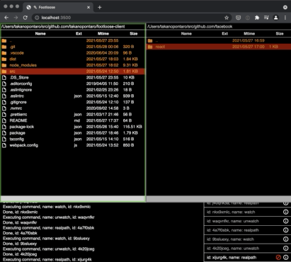
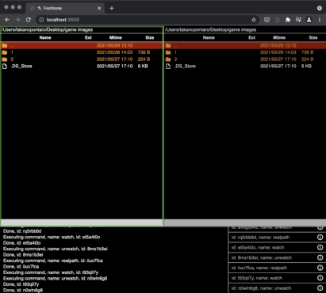

Japanese follows English. 日本語は英語の後にあります。

# &#x1F45F; Footloose

Footloose is the dual-pane visual file manager made by React and works on web browsers.

It's made with server and client architecture. Web and Socket servers will start up when the application runs. Web browsers are used as clients.

Footloose is made for keyboard users. It's possible to use a mouse but almost all features aren't available.

&#x1F45F;&#x1F45F;&#x1F45F;&#x1F45F;&#x1F45F;&#x1F45F;



## Related packages

- footloose (this package)
- [footloose-client](https://github.com/takanopontaro/footloose-client) (browser client)
- [footloose-config](https://github.com/takanopontaro/footloose-config) (default configuration)

## Usage

```shell
$ npx footloose -p 3500
```

Access `http://localhost:3500` by your browser then Footloose will be shown.

|option|description|
|-|-|
|p|Port number|
|m|Whether to let Footloose get MIME types of binary files or not. It may slow the application depending on sizes of files in the directory. You don't need this option if MIME types aren't necessary.|
|c|User configuration (mentioned later)|

### Layout

Footloose consists of 3 frames and 2 modes.



### Normal mode



### Gallery mode



## System requirements

Currently, I check this application only on MacOS. I don't have Windows and Linux workstations so I'm not sure that Footloose will work or not on these systems. The default configuration is written assuming MacOS.

Footloose is beta version so there are some bugs maybe. Please enjoy at your own risk.

Node.js is required version 14.14.0 or later.

## Keyboard Shortcuts

Footloose uses [Mousetrap](https://craig.is/killing/mice) for managing keyboard shortcuts. Almost same rules of Mousetrap are available. It's possible to write multiple keys with `,` so you need to write `comma` if you want to express comma it self.

Keyboard shortcuts are separated by contexts. The defaults are below.

### Application

|key(s)|description|
|-|-|
|tab, shift+tab|Disabled|
|~|Move focus among frames|

### Dialog (alert, prompt, confirm)

|key(s)|description|
|-|-|
|tab, shift+tab|Move focus among elements|
|enter|Process|
|escape|Cancel|

### Dialog (item selector. history and bookmark)

|key(s)|description|
|-|-|
|tab, shift+tab|Move focus among areas|
|enter|Process|
|escape|Cancel|
|up, down|Move focus among items|
|backspace, delete|Delete a item|

### Directory frame

|key(s)|description|
|-|-|
|Number, Lowercase letters, _ - .|Direct select by first letter|
|tab, shift+tab|Move focus to a filter input|
|enter|Process current row|
|backspace, delete|Move to the parent directory|
|pageup, pagedown|page scoll|
|home, end|Move cursor to top or bottom|
|up, down|Move cursor|
|left, right|Move focus among directory frames (In Gallery mode, move cursor)|
|shift+left, shift+right|Move focus among directory frames|
|meta+left, meta+right|History back or forward|
|space|Select current row|
|shift+a|Select all rows|
|shift+ctrl+a|Deselect all rows|
|shift+ctrl+meta+a|Invert selections of all rows|
|shift+c|Copy item(s) to the target frame|
|shift+m|Move item(s) to the target frame|
|shift+z|Zip item(s) and save it to the target frame|
|shift+ctrl+z|Unarchive to the target frame|
|shift+d|Delete|
|shift+k|Make a directory|
|shift+t|Make a file|
|shift+r|Rename|
|f5|Refresh|
|plus|Copy paths of active items(s) to clipboard|
|_|Copy a path of current directory to clipboard|
|shift+i|Write logs about information of current directory and active item(s)|
|escape|Clear filter input text|
|shift+h|Show history dialog|
|shift+b|Show bookmark dialog|
|shift+ctrl+b|Bookmark current directory|
|shift+j|Change directory|
|shift+p|Make self path the same as target frame|
|shift+ctrl+p|Make target path the same as self frame|
|shift+ctrl+meta+p|Exchange paths between frames|
|shift+o|Open the active item|
|shift+ctrl+o|Reveal the active item in finder|
|!|Change position of ellipsis of long item name|
|shift+g|Switch to Gallery mode|

### Filter input

|key(s)|description|
|-|-|
|tab, shift+tab|Move focus|
|escape, enter|Clear input|
|up, down|Move cursor|

### Log frame

nothing

### Task manager frame

|key(s)|description|
|-|-|
|tab, shift+tab|Move focus|

## User configuration

By default, it's not possible to change design, keyboard shortcuts or something. It will be available to specify user configuration directory when start the application.

```shell
$ npx footloose -p 3500 -c /path/to/your-config-dir
```

### The default configuration

It's very useful to clone the default configuration because it's written by TypeScript. Edit and compile it so dist directory will be published. Specify this directory to `-c` option. This directory is public on Footloose web server so you can access this by web browsers.

[https://github.com/takanopontaro/footloose-config](https://github.com/takanopontaro/footloose-config)

There are 3 main files.

### index.html

HTML of Footloose. It's not necessary to edit this file but you can edit it if you want to do.

### theme.scss

Style file of Footloose. To change design of Footloose, edit this. Available SCSS.

### bootstrap.js

Bootstrap of Footloose. Functions for application settings and key maps must be default exported. Note that key maps function will be executed multiple times so you have to keep idempotent.

|function|description|
|-|-|
|getSettings|For settings of each frames|
|getKeyMaps|For key maps. Executed multiple times.|

`getSettings` is separated by contexts below.

### Application

|property|description|
|-|-|
|persistentSettings|Whether to save current directories, sorts or something to localStorage|

### Directory frame

|property|description|
|-|-|
|selectedRowsOnly|When you try to action like copy or move, selected rows are targeted. If none of selected rows, current row is used. Set this option true if you prefer selected rows only.|
|openPathApps|Configuration for opening file. For details to [here](https://github.com/sindresorhus/open#app).|
|sorts|Default sorts|
|filter|Default filter input text (RegExp)|
|path|Default directory|
|previewMaker|Render function for Gallery mode|

### Log frame

|property|description|
|-|-|
|filter|Filter function that accepts log data as only parameter. Return true to show, false to hide.|

### Task manager frame

|property|description|
|-|-|
|filter|Filter function that accepts task data as only parameter.|

## Licence

MIT © takanopontaro

&#x1F45F;&#x1F45F;&#x1F45F;&#x1F45F;&#x1F45F;&#x1F45F;

# &#x1F45F; Footloose

Footloose は React で作られたブラウザーベースの二画面ファイラーです。ファイラーとは、コピーや移動、リネームなど一連のファイル操作を行うソフトウェアのことで、いわゆるファイルマネージャー、Mac で言うところの Finder、Windows での Explorer にあたります。

二画面ファイラーは左右二画面を同時表示してファイル操作するという特徴があり、使い方によっては業務効率をかなり上げることができます。

Footloose はクライアント＆サーバーのアーキテクチャで作られており、起動すると Web + Socket サーバーが立ち上がり、クライアントソフトウェアとしてブラウザーを使用します。キーボードによる操作を前提としており、マウスでは主要な機能はほとんど使えません。

&#x1F45F;&#x1F45F;&#x1F45F;&#x1F45F;&#x1F45F;&#x1F45F;


## 関連パッケージ

- footloose（このパッケージ）
- [footloose-client](https://github.com/takanopontaro/footloose-client)（ブラウザー用のクライアント）
- [footloose-config](https://github.com/takanopontaro/footloose-config)（デフォルトのコンフィグ）

## 使い方

```shell
$ npx footloose -p 3500
```

ブラウザーで `http://localhost:3500` にアクセスすると Footloose が表示されます。

|オプション|説明|
|-|-|
|p|ポート番号|
|m|バイナリファイルのMIMEタイプを取得するか否か。ディレクトリー内の各ファイルのサイズによっては表示が重くなります。MIMEタイプが不要なら指定しないでOKです。|
|c|ユーザーコンフィグ（後述）|

### レイアウト

Footloose は以下のように、ディレクトリー、ログ、タスクマネージャーの 3 つのフレームで構成されており、基本的にはディレクトリーフレームを使用します。ファイル操作やコマンドの実行結果がログフレームに出力され、タスクマネージャーには現在実行中のコマンドが表示されます。コマンド実行結果の確認や中止もここから可能です。デフォルトでは全コマンドが表示されますが、フィルタをかけることもできます。


### 通常モード


### ギャラリーモード


## 動作環境

Mac でのみ確認しています。Windows, Linux は環境が無いため未確認です。デフォルトの設定が Mac を想定したものになっているため、上手く動かない可能性が高いです。Windows には [あふ](http://akt.d.dooo.jp/akt_afxw.html) という非常に素晴らしい二画面ファイラーがあり、Footloose も多大な影響を受けています。Windows の方は [あふ](http://akt.d.dooo.jp/akt_afxw.html) の使用をオススメします。

現在ベータ版のため、細かい不具合がある可能性があります。特にデザインは素人のためかなりイケてません &#x1f4a9; が、後述するように見た目は自分で変更可能です。

必要な Node.js のバージョンは 14.14.0 以上です。

## キーボードショートカット

Footloose はキーボードショートカットの管理に [Mousetrap](https://craig.is/killing/mice) を使用しています。Mousetrap とほぼ同じルールでショートカットの設定ができ、キーボードから Footloose の多彩なコマンドを呼び出すことでアプリケーションの操作を行っています。カンマ区切りで複数のキーを一度に登録できるため、カンマ自体を表現したいときは文字列としての `comma` を使用します。

ショートカットはコンテキストごとに分けられており、デフォルトで以下が設定されています。

### アプリケーション

|キー|説明|
|-|-|
|tab, shift+tab|無効|
|~|フレーム間のフォーカス移動|

### ダイアログ（alert, prompt, confirm など）

|キー|説明|
|-|-|
|tab, shift+tab|フォーム要素間のフォーカス移動|
|enter|決定|
|escape|キャンセル|

### ダイアログ（item selector。履歴やブックマークなど）

|キー|説明|
|-|-|
|tab, shift+tab|エリア間のフォーカス移動|
|enter|決定|
|escape|キャンセル|
|up, down|候補間のフォーカス移動|
|backspace, delete|候補の削除|

### ディレクトリーフレーム

|キー|説明|
|-|-|
|数字, 英小文字, _ - .|1 文字目によるダイレクト選択|
|tab, shift+tab|絞り込み入力欄へのフォーカス移動|
|enter|カレント行の実行|
|backspace, delete|親ディレクトリーへの移動|
|pageup, pagedown|ページング|
|home, end|先頭末尾へのカレント行の移動|
|up, down|カレント行の移動|
|left, right|窓間のフォーカス移動。※ギャラリー時はカーソル移動|
|shift+left, shift+right|窓間のフォーカス移動|
|meta+left, meta+right|履歴の行き来|
|space|カレント行の選択|
|shift+a|全行選択|
|shift+ctrl+a|全行非選択|
|shift+ctrl+meta+a|選択状態の反転|
|shift+c|相手窓へコピー|
|shift+m|相手窓へ移動|
|shift+z|zip して相手窓へ保存|
|shift+ctrl+z|zip ファイルを相手窓へ解凍|
|shift+d|削除|
|shift+k|ディレクトリーの作成|
|shift+t|ファイルの作成|
|shift+r|リネーム|
|f5|再読み込み|
|plus|アクティブアイテムのパスをクリップボードにコピー|
|_|カレントディレクトリーをクリップボードにコピー|
|shift+i|カレントディレクトリーやアクティブアイテムをログフレームに出力|
|escape|絞り込み入力欄のクリア|
|shift+h|履歴の表示|
|shift+b|ブックマークの表示|
|shift+ctrl+b|カレントディレクトリーをブックマーク|
|shift+j|ディレクトリーの変更|
|shift+p|自窓を相手窓と同じディレクトリーにする|
|shift+ctrl+p|相手窓を自窓と同じディレクトリーにする|
|shift+ctrl+meta+p|両窓のディレクトリーを入れ替える|
|shift+o|アクティブアイテムを開く|
|shift+ctrl+o|アクティブアイテムを Finder で開く|
|!|長いアイテム名の省略位置を変える|
|shift+g|ギャラリーモードへの切り替え|

### 絞り込み入力欄

|キー|説明|
|-|-|
|tab, shift+tab|フォーカスの移動|
|escape, enter|入力欄のクリア|
|up, down|カレント行の移動|

### ログフレーム

なし

### タスクマネージャーフレーム

|キー|説明|
|-|-|
|tab, shift+tab|フォーカスの移動|

## イジェクト

デフォルトでは、見た目はおろかショートカットすら変更できませんが、イジェクトという機能を使うとそれが可能になります。…と言ってもそういうコマンドがあるわけではなく &#x1f4a9; 、単に Footloose を立ち上げる時に設定ファイルのあるディレクトリーを指定するだけです。

```shell
$ npx footloose -p 3500 -c /path/to/your-config-dir
```

### デフォルトのコンフィグ

デフォルトのコンフィグをクローンすると、TypeScript なので型が付いていてとても便利です。編集＆コンパイルすると dist ディレクトリーができますので、ここを `-c` オプションで指定するのが一番手っ取り早いでしょう。このディレクトリーは Footloose サーバーの公開ディレクトリーになるので、ブラウザーからアクセス可能になります。

[https://github.com/takanopontaro/footloose-config](https://github.com/takanopontaro/footloose-config)

主なファイルは以下の 3 つです。

### index.html

Footloose の HTML。基本的に変更する必要はありませんが、いじることは可能です。

### theme.scss

Footloose のデザインを定義しているスタイルファイル。見た目を変える場合はこのファイルを編集します。SCSS で記述することが可能です。

### bootstrap.js

Footloose の立ち上げ時に実行されるファイル。アプリケーションの設定とキーマップを定義する関数を default export します。キーマップ関数は何度も実行されるため、冪等性を保つ必要があります。

|関数|説明|
|-|-|
|getSettings|各フレームの設定関数|
|getKeyMaps|キーマップ定義関数。何度も実行される。|

設定関数 `getSettings` は以下のコンテキストに分かれています。

### アプリケーション

|プロパティ|説明|
|-|-|
|persistentSettings|カレントディレクトリーやソート状態などを localStorage に保存するか否か|

### ディレクトリーフレーム

|プロパティ|説明|
|-|-|
|selectedRowsOnly|コピーや移動をするときは、選択行があればそれを、無ければカレント行を対象にします。この設定を `true` にすると選択行のみを対象とするようになります|
|openPathApps|ファイルを開く時のアプリケーションを設定します。詳しくは[こちら](https://github.com/sindresorhus/open#app)。|
|sorts|デフォルトのソート|
|filter|デフォルトの絞り込み正規表現文字列|
|path|デフォルトのディレクトリー|
|previewMaker|ギャラリーモード時のレンダー関数|

### ログフレーム

|プロパティ|説明|
|-|-|
|filter|ログデータを引数に取り、`true` なら表示、`false` なら非表示にするフィルタ関数|

### タスクマネージャーフレーム

|プロパティ|説明|
|-|-|
|filter|タスクデータを引数に取るフィルタ関数|

## 鋭意制作中

現在ドッグフーディングしながら随時更新中です。ドキュメントがまったく間に合っていませんが、コンフィグの書式は TypeScript のおかげでだいぶ分かるようになっています。

## 紹介記事

- [Qiita](https://qiita.com/takanopontaro/items/58a4474e88f439330ab5)
- [Zenn](https://zenn.dev/takanopontaro/articles/c4c86d14e6aab7)

## ライセンス

MIT © takanopontaro
